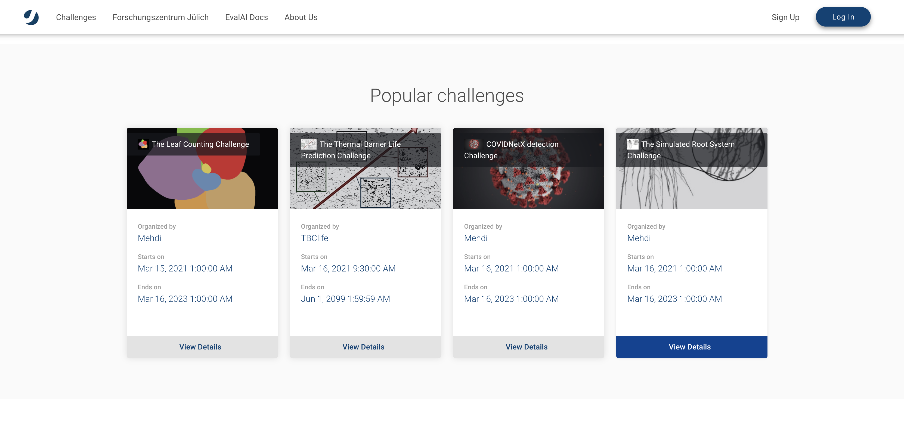
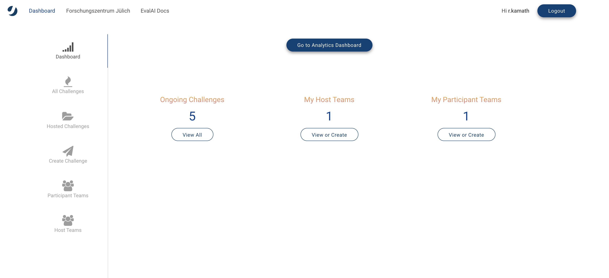
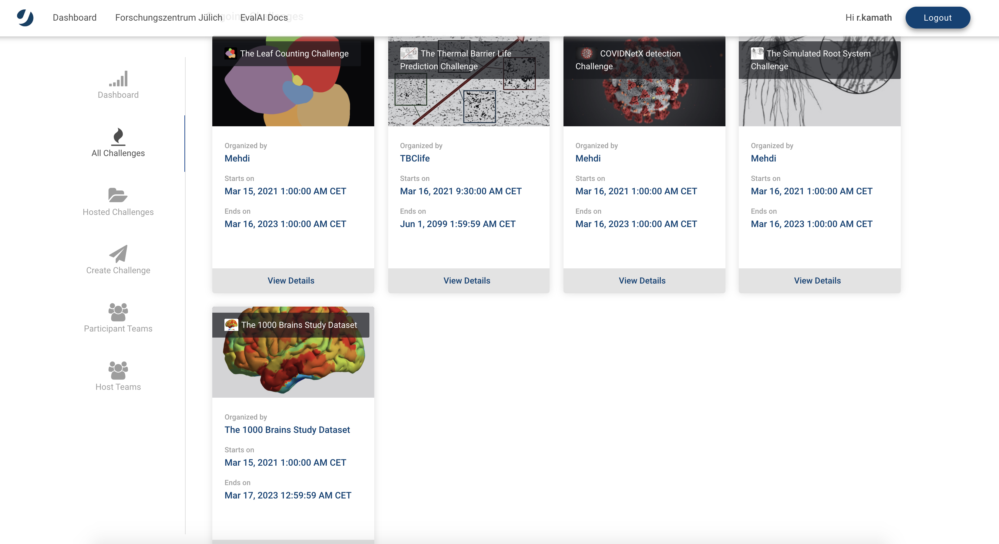
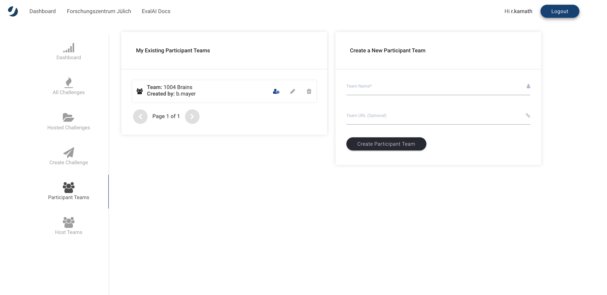
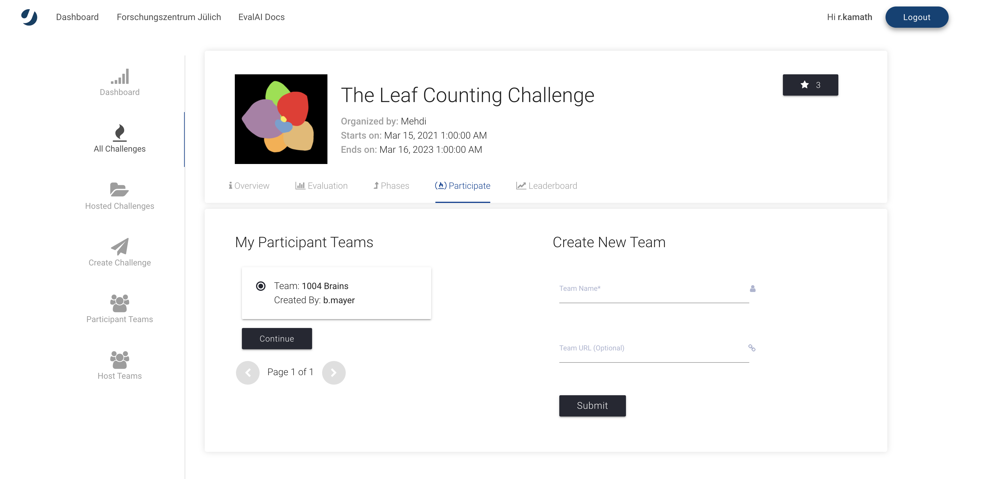
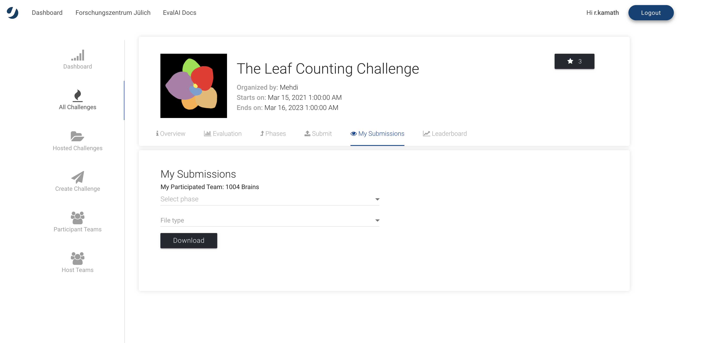
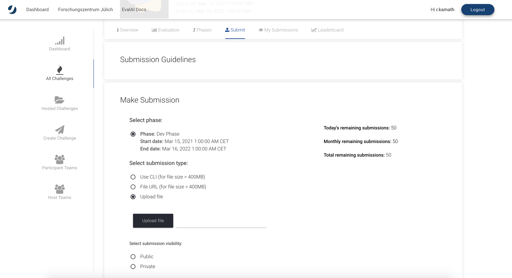

# Welcome to Helmholtz Data Challenges

## About Us

[Helmholtz Data Challenges](https://helmholtz-data-challenges.de/) is a platform for data challenges with scientific data from the Helmholtz Association, Germany’s largest research organization.

We are a group of machine learning researchers from diverse research areas, different Helmholtz research centers, representing all Helmholtz incubator platforms. We aim to advance data technologies and dissemination of best practices by hosting and supporting data science challenges. Platform development is mainly driven by the Helmholtz AI Consultant Team at Jülich Supercomputing Centre (JSC) and the Institute for Data Analytics and Machine Learning (IAS-8), both at Forschungszentrum Jülich, as well as scientists from the Helmholtz Imaging Service Unit ‘Applied Computer Vision Lab‘ at DKFZ.

The mission of the Helmholtz Data Challenges is to provide a premier academic data-challenges platform to the scientific community. Our aim is to offer a platform independent from commercial interests, allowing for transparent and high-quality validation, benchmarking, performance-based ranking of algorithms and collaborative work on outstanding scientific projects featuring unique data collected by Helmholtz facilities, supporting open science and reproducibility. We strive to make it easy to work with us and our platform, supporting data-challenge design and setup to meet highest scientific standards. In its data processing, the platform commits itself to the FAIR principles as well as fair licensing conditions. However, we are not there yet. This is work in progress, we will add more features to the platform within the next months. Please explore what the platform is capable of already and feel free to provide feedback and suggestions for new features.

Contact: data-challenges@fz-juelich.de

The Helmholtz Data Challenges platform was built on the basis of EvalAI, a great open source data challenge platform.

Implementation: [The AI consultant team at Forschungszentrum Jülich](https://www.helmholtz.ai/themenmenue/our-research/consultant-teams/helmholtz-ai-consultants-fzj/index.html)

## How to host a challenge on the Helmholtz Data Challenge platform

1. Setup challenge configuration  
    We have created a sample challenge configuration that we recommend you to use to get started available at [link](https://github.com/HelmholtzAI-FZJ/juelich_challenges-template-challenge). Clone this repository and follow the next steps.

2. Edit challenge configuration  
    Open `challenge_config.yml` from the repository that you cloned in step-1. A challenge can be divided into many phases (or challenge phases) and a challenge phase can have the same or different start and end date than the challenge start and end date. The `challenge_config.yml` file defines all the different settings of your challenge such as start date, end date, number of phases, and submission limits etc that allows to structure your challenge. Edit this file based on your requirement.

    You can refer to [link](https://evalai.readthedocs.io/en/latest/configuration.html) for more details to configure the file based on your requirement.

3. Edit evaluation script  
    Next step is to edit the challenge evaluation script `evaluation_script` that decides what metrics the submissions are going to be evaluated on for different phases. The `evaluation_script` evaluates the submission of participants and returns the scores which will populate the leaderboard. The logic for evaluating and judging a submission is customizable and varies from challenge to challenge. 

    You can refer to [link](https://evalai.readthedocs.io/en/latest/evaluation_scripts.html) to edit the file based on your requirement.

4. Edit challenge HTML templates  
    Now, you just need to update the HTML templates in the `templates/` directory of the bundle that you cloned. Each html files provides details such as challenge backgroud, evaluaton criteria, directions to download data, terms and condition, links to other useful resource, etc. to the participants. Yon can add text relevent to the your challenge. 

5. Upload configuration on Helmholtz Data Challenge platform  
    Finally run the `./run.sh` script in the bundle. It will generate a challenge_config.zip file that contains all the details related to the challenge. Now, visit [Helmholtz Data Challenge](https://helmholtz-data-challenges.de/) - Host challenge page and select/create a challenge host team. Then upload the `challenge_config.zip`.

## How to participate in a Helmholtz Data Challenge

1. Visit [Helmholtz Data Challenges](https://helmholtz-data-challenges.de/)

2. Sign up or Log in 
Sign Up and fill in your credentials or log in if you have already registered.

3. After signing up you would be on the dashboard page.

4. Select a challenge 
Then, go to challenges section and choose an active challenge.

5. Challenge Page 
After reading the challenge instructions on the challenge page, you can participate in the challenge.

6. Create Participant Team 
Create a participant team if there isn’t any or you can select from the existing ones. Click on ‘Participate’ tab after selecting a team.

## How to submit your solution to a Helmholtz Data Challenge

The challenge you would like to contribute to gives you instructions how to download the respective data set. Several of them host their data directly on the challenges platform available at this link: [link](https://storage.data-challenges.fz-juelich.de/). Navigate there to download the files associated with the challenge. Each Helmholtz Data Challenge comes with a zip files containing the datasets and information about the challenge and a Jupyter Notebook.

    ### Challenge Layout

    data_public_leaderboard_phase.tar.gz    #
    notebook.ipynb    # The notebook file.

The `notebook.ipynb` contains the first steps to approach the problem that demonstrates a baseline solution. We hope that this will be a useful resource to you to explore the data and perform some data analysis and come up with a better solution. The `notebook.ipynb` file also contains the code to generate the `submision.csv`.

After generating the `submision.csv` file, you can simply upload the csv file to the challenge frontend at [link](https://helmholtz-data-challenges.de/). 

